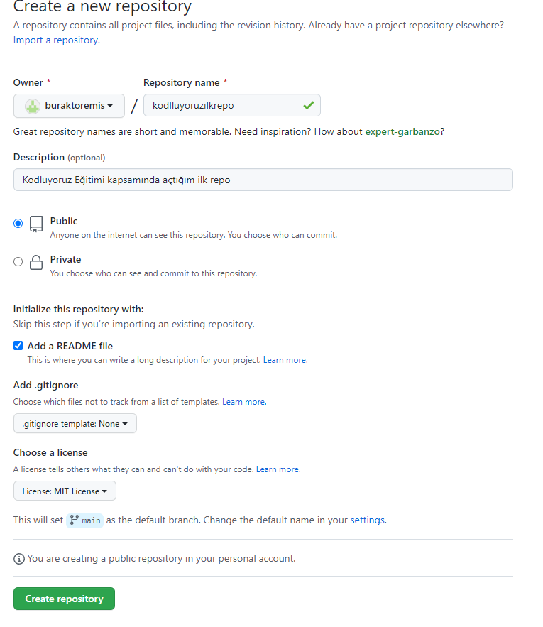

# kodluyoruzilkrepo
"Kodluyoruz Eğitimi kapsamında açtığım ilk repo"

Bu repo [Kodluyoruz](https://github.com/buraktoremis) Front-End Eğitiminde oluşturduğumuz ilk repo. İçerisinde bir adet README dosyası, bir adet de index.html barındırıyor.



```
git add README.md
```

## Installation

Öncelikle projeyi clonelayın. (https://github.com/buraktoremis/kodluyoruzilkrepo.git)

```
git clone https://github.com/buraktoremis/kodluyoruzilkrepo.git
```

## Usage

Projeyi cloneladıktan sonra Visual Studio Code programında açınız.

Linux için:

```
cd kodluyoruzilkrepo
code .
```

## Contributing

Pull requestler kabul edilir. Büyük değişiklikler için, lütfen önce neyi değiştirmek istediğinizi tartışmak için bir konu açınız.


## License

[MIT](https://choosealicense.com/licenses/mit/)

